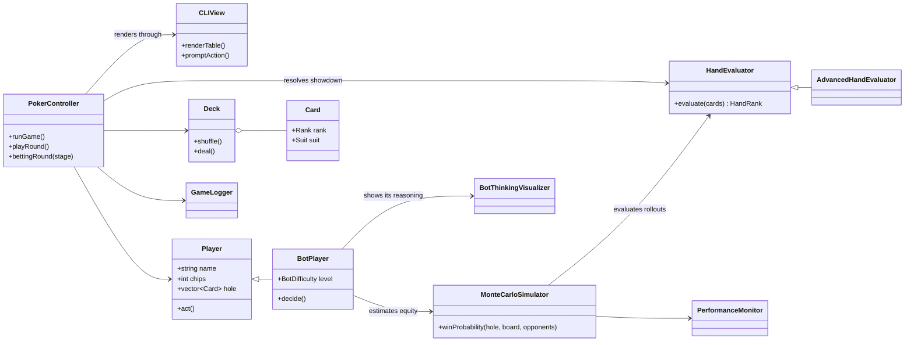
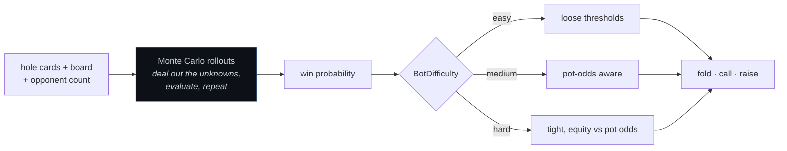

# 🃏 CLI Texas Hold'em Poker Game in C++

This project is a **command-line Texas Hold'em poker game** built in modern **C++17**, featuring a multithreaded bot, clean MVC design, and strategic hand evaluation logic.

---

## ♠️ Features (Implemented)

- ✅ Card & Deck generation (with emojis for suits ♠️♦️♥️♣️)
- ✅ Full game loop with betting and showdown
- ✅ **Bot opponent with Easy/Medium/Hard difficulty**
- ✅ **Multithreaded spinner animation** while bot thinks
- ✅ Hand evaluator (frequency maps, sorting)
- ✅ Clear CLI interface (check, bet, fold actions)
- ✅ SOLID design with `BotPlayer` subclass
- ✅ MVC Pattern: clean separation of model, controller, view

---

## 📜 Poker Rules - Texas Hold'em

1. **2 hole cards** dealt to each player
2. **5 community cards** revealed in stages:
   - **Flop** (3 cards)
   - **Turn** (1 card)
   - **River** (1 card)
3. Make the **best 5-card poker hand**
4. Actions: `check`, `bet`, `fold`
5. Win by:
   - Forcing opponent to fold
   - Having a better hand at showdown

---

## 🏆 Hand Rankings (Best to Worst)

1. Royal Flush
2. Straight Flush
3. Four of a Kind
4. Full House
5. Flush
6. Straight
7. Three of a Kind
8. Two Pair
9. One Pair
10. High Card

---

## 🤖 Bot Difficulty Logic

You can choose bot difficulty at the start:
- **Easy**: Randomly calls ~25% of the time
- **Medium**: Calls if hand ≥ One Pair
- **Hard**: Calls if hand is good, but may bluff ~20% with weak hands

---

## 🧠 Architecture Overview



**Strict MVC.** `model/` knows nothing about how the game is displayed, `view/` knows nothing
about the rules, and `controller/` is the only thing that talks to both. That separation is
what makes the hand evaluator unit-testable in isolation, which matters because a poker game
where the evaluator is subtly wrong is not a game.

### How the bot actually decides



The bot does not use a lookup table or hand-tuned heuristics for hand strength. It deals out
the unknown cards many times, evaluates each complete board with the same evaluator the real
game uses, and counts how often it wins. Difficulty changes what it does with that number,
not how the number is produced. Rollouts are the reason the simulator is multithreaded: the
work is embarrassingly parallel and the game has to stay responsive.


### 🔹 `Card` & `Deck`
- Card = suit + rank
- Deck = 52-card generation + shuffling

### 🔹 `Player` & `BotPlayer`
- `Player`: name, chip count, hand
- `BotPlayer`: subclass with `shouldCallBet()` based on difficulty

### 🔹 `HandEvaluator`
- Uses frequency maps and sorted ranks
- Detects pairs, trips, flushes, full house, straights, etc.

### 🔹 `PokerController`
- Manages game loop, betting, round progression

### 🔹 `CLIView`
- Handles output formatting and emoji display
- Includes `Spinner` animation using multithreading

---

## 🔄 How a Round Works

1. Deal hole cards
2. Reveal flop → turn → river
3. User chooses action
4. Bot decides based on difficulty
5. Evaluate hands and determine winner
6. Update chip counts

---

## 🤹 Strategy Guide: How Poker Players Think

- Is my pre-flop hand strong?
- Did the flop improve my hand?
- What could the opponent be holding?
- Should I bluff or fold?
- What’s the pot odds and EV?

---

## 🧰 How to Run the Game

### 📦 Requirements
- macOS or Linux with **clang++ or g++**
- C++17 compatible terminal setup
- (Optional) Sublime Text or VSCode

### ▶️ Compile and Run
```bash
make clean
make run
```

or without MakeFile
```bash
clang++ -std=c++17 main.cpp controller/poker_controller.cpp view/cli_view.cpp \
model/card.cpp model/deck.cpp model/player.cpp model/hand_evaluator.cpp \
model/advanced_hand_evaluator.cpp model/bot_player.cpp animation/spinner.cpp -o poker && ./poker
```